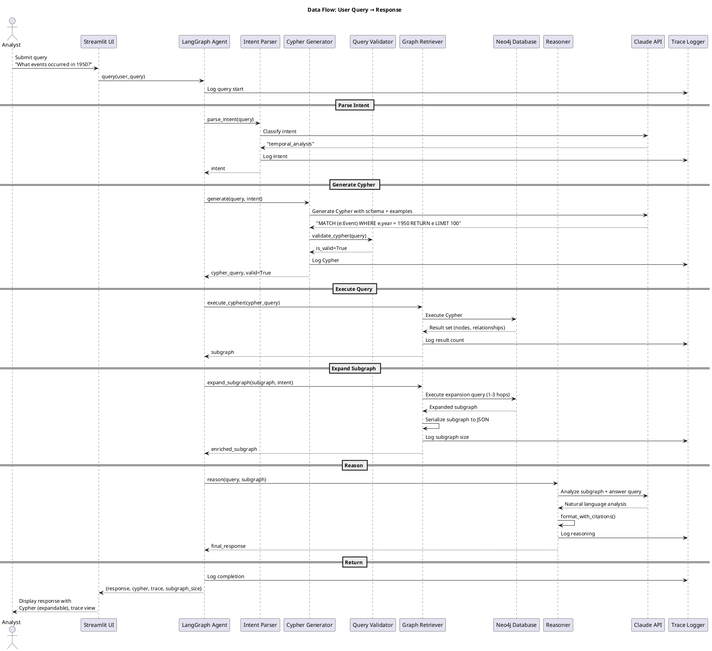
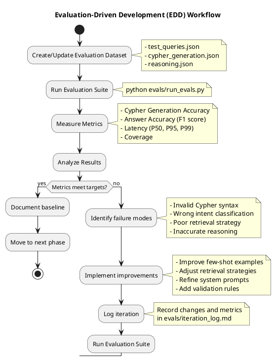

# SPEED-CAMEO System Architecture

This document describes the architecture of the SPEED-CAMEO Temporal Knowledge Graph & Intelligence System using C4 model diagrams.

## Table of Contents

1. [System Context (C4 Level 1)](#system-context-c4-level-1)
2. [Container Diagram (C4 Level 2)](#container-diagram-c4-level-2)
3. [Component Diagram (C4 Level 3)](#component-diagram-c4-level-3)
4. [Data Flow Diagram](#data-flow-diagram)
5. [Evaluation-Driven Development Workflow](#evaluation-driven-development-workflow)

---

## System Context (C4 Level 1)

The system context diagram shows how the SPEED-CAMEO system fits into the broader environment and interacts with external actors and systems.

```plantuml
@startuml
!include https://raw.githubusercontent.com/plantuml-stdlib/C4-PlantUML/master/C4_Context.puml

LAYOUT_WITH_LEGEND()

title System Context Diagram for SPEED-CAMEO Intelligence System

Person(analyst, "Analyst/Researcher", "Investigates historical events using natural language queries")

System(speedkg, "SPEED-CAMEO System", "Temporal knowledge graph with intelligent query interface for SPEED historical event data")

System_Ext(neo4j, "Neo4j Database", "Graph database storing 62K+ historical events with CAMEO ontology")
System_Ext(claude_api, "Claude API", "Anthropic's Claude for Cypher generation and reasoning")
System_Ext(data_sources, "SPEED Data Sources", "CSV data files and CAMEO reference files")

Rel(analyst, speedkg, "Asks questions about historical events", "HTTPS")
Rel(speedkg, neo4j, "Queries events and relationships", "Bolt Protocol")
Rel(speedkg, claude_api, "Generates Cypher queries, reasons over subgraphs", "HTTPS/REST")
Rel(speedkg, data_sources, "Ingests event data during initialization", "File I/O")

@enduml
```

---

## Container Diagram (C4 Level 2)

The container diagram shows the high-level technology choices and how containers interact within the SPEED-CAMEO system.

```plantuml
@startuml
!include https://raw.githubusercontent.com/plantuml-stdlib/C4-PlantUML/master/C4_Container.puml

LAYOUT_WITH_LEGEND()

title Container Diagram for SPEED-CAMEO System

Person(analyst, "Analyst", "Researcher investigating historical events")

System_Boundary(speedkg, "SPEED-CAMEO System") {
    Container(streamlit_ui, "Streamlit UI", "Python, Streamlit", "Provides web interface for chat, schema view, and agent trace")
    Container(langgraph_agent, "LangGraph Agent", "Python, LangGraph", "Orchestrates query workflow: intent parsing, Cypher generation, retrieval, reasoning")
    Container(ingestion, "Data Ingestion Pipeline", "Python, Pandas", "Loads SPEED CSV and CAMEO ontology into Neo4j")
}

ContainerDb(neo4j_db, "Neo4j Graph DB", "Neo4j 5.x + APOC", "Stores events, actors, locations, and CAMEO ontology as graph")
System_Ext(claude_api, "Claude API", "LLM for Cypher generation and reasoning")
System_Ext(data_files, "Data Files", "ssp_public.csv, CAMEO reference files")

Rel(analyst, streamlit_ui, "Interacts with", "HTTPS")
Rel(streamlit_ui, langgraph_agent, "Submits queries, receives responses", "Function calls")
Rel(langgraph_agent, neo4j_db, "Executes Cypher queries, retrieves subgraphs", "Bolt")
Rel(langgraph_agent, claude_api, "Generates queries, reasons over data", "HTTPS")
Rel(ingestion, data_files, "Reads CSV and ontology files", "File I/O")
Rel(ingestion, neo4j_db, "Loads events and relationships", "Bolt")
Rel(streamlit_ui, neo4j_db, "Fetches schema metadata", "Bolt")

@enduml
```

---

## Component Diagram (C4 Level 3)

The component diagram details the internal structure of the LangGraph Agent container, showing the key components and their responsibilities.

```plantuml
@startuml
!include https://raw.githubusercontent.com/plantuml-stdlib/C4-PlantUML/master/C4_Component.puml

LAYOUT_WITH_LEGEND()

title Component Diagram - LangGraph Agent Internal Structure

Container(streamlit_ui, "Streamlit UI", "Sends queries, displays results")
ContainerDb(neo4j_db, "Neo4j Database", "Graph data storage")
System_Ext(claude_api, "Claude API", "LLM services")

Container_Boundary(agent_container, "LangGraph Agent") {
    Component(state_machine, "State Machine", "LangGraph", "Orchestrates workflow through states: ParseIntent → GenerateCypher → ExecuteQuery → RetrieveSubgraph → Reason → Format")

    Component(intent_parser, "Intent Parser", "Python, Claude", "Classifies query intent: single_event, event_chain, actor_analysis, pattern_analysis")

    Component(cypher_generator, "Cypher Generator", "Python, Claude, Few-shot prompting", "Generates syntactically valid Cypher queries with security validation")

    Component(graph_retriever, "Graph Retriever", "Python, Neo4j driver", "Executes Cypher, expands subgraphs based on intent (1-3 hops, max 500 nodes)")

    Component(reasoner, "Reasoner", "Python, Claude", "Analyzes subgraph data, generates natural language responses with citations")

    Component(validator, "Query Validator", "Python", "Validates Cypher syntax, prevents injection, enforces read-only queries")

    Component(serializer, "Subgraph Serializer", "Python", "Converts Neo4j results to JSON/text format for Claude")

    Component(trace_logger, "Trace Logger", "structlog", "Logs all agent steps for observability and UI display")
}

Rel(streamlit_ui, state_machine, "Invokes query()", "Sync call")
Rel(state_machine, intent_parser, "Calls parse_intent()")
Rel(state_machine, cypher_generator, "Calls generate()")
Rel(state_machine, graph_retriever, "Calls execute_cypher(), expand_subgraph()")
Rel(state_machine, reasoner, "Calls reason(), format_with_citations()")

Rel(intent_parser, claude_api, "Classifies intent", "API call")
Rel(cypher_generator, claude_api, "Generates Cypher", "API call")
Rel(cypher_generator, validator, "Validates query", "Function call")
Rel(graph_retriever, neo4j_db, "Executes Cypher", "Bolt")
Rel(graph_retriever, serializer, "Serializes results", "Function call")
Rel(reasoner, claude_api, "Reasons over subgraph", "API call")

Rel(state_machine, trace_logger, "Logs state transitions", "Logging")
Rel(intent_parser, trace_logger, "Logs intent", "Logging")
Rel(cypher_generator, trace_logger, "Logs Cypher", "Logging")
Rel(graph_retriever, trace_logger, "Logs retrieval", "Logging")
Rel(reasoner, trace_logger, "Logs reasoning", "Logging")

@enduml
```

---

## Data Flow Diagram

This sequence diagram shows the end-to-end flow of a user query through the system.



---

## Evaluation-Driven Development Workflow

This diagram illustrates the continuous evaluation and improvement cycle.



---

## Key Architectural Patterns

### 1. Domain-Driven Design (DDD)

The codebase is organized by domain:
- **Domain Layer** (`src/domain/`): Core entities (Event, Actor, CAMEO types)
- **Ingestion Layer** (`src/ingestion/`): Data loading and validation
- **Intelligence Layer** (`src/intelligence/`): Query processing and reasoning
- **UI Layer** (`src/ui/`): User interaction
- **Utils Layer** (`src/utils/`): Cross-cutting concerns (config, logging)

### 2. GraphRAG Pattern

The system implements GraphRAG (Graph Retrieval-Augmented Generation):
1. **Query → Cypher**: Natural language converted to graph query
2. **Retrieval**: Relevant subgraph extracted from Neo4j
3. **Augmentation**: Subgraph context provided to LLM
4. **Generation**: LLM generates answer with graph-grounded citations

### 3. State Machine Pattern (LangGraph)

The agent uses a state machine for explicit workflow control:
- **States**: ParseIntent, GenerateCypher, ExecuteQuery, RetrieveSubgraph, Reason, FormatResponse, HandleError
- **Transitions**: Conditional edges based on validation results
- **Trace**: Every state transition logged for observability

### 4. Hybrid Static-Dynamic Schema

Neo4j schema balances structure and flexibility:
- **Static**: Core entities with indexes (Event, Actor, Location, EventType)
- **Dynamic**: Sparse fields stored as JSON properties
- **Rationale**: 106 CSV columns with 93-100% missing rates don't warrant full normalization

### 5. Adaptive Retrieval Strategy

Subgraph retrieval adapts to query intent:
- **single_event**: 1 hop, 100 nodes
- **event_chain**: 2 hops, 300 nodes
- **actor_analysis**: 2 hops, 500 nodes
- **pattern_analysis**: 3 hops, 500 nodes, aggregation mode

---

## Technology Stack

| Layer | Technology | Purpose |
|-------|-----------|---------|
| UI | Streamlit | Web interface |
| Agent Framework | LangGraph | State machine workflow |
| LLM | Claude 3.5 Sonnet | Cypher generation, reasoning |
| Graph DB | Neo4j 5.x + APOC | Event storage and querying |
| Data Processing | Pandas | CSV ingestion |
| Logging | structlog | Structured trace logging |
| Testing | pytest | Unit, integration, E2E tests |
| Containerization | Docker Compose | Neo4j + App orchestration |
| Package Management | uv | Fast Python dependency resolution |

---

## Security Considerations

1. **Cypher Injection Prevention**: Whitelist validation, block DELETE/DROP/REMOVE
2. **Read-Only Queries**: Agent enforces SELECT-only operations
3. **Environment Variables**: All secrets in .env (never committed)
4. **API Key Protection**: Claude API key validated at startup
5. **LIMIT Enforcement**: Auto-add LIMIT to prevent resource exhaustion

---

## Performance Targets

| Metric | Target | Measurement |
|--------|--------|-------------|
| Query Response (P95) | <3 seconds | End-to-end from UI submit to response |
| Cypher Generation | >90% valid | Syntactic correctness in evals |
| Answer Accuracy | >70% | F1 score against expected results |
| Ingestion Time | <10 minutes | Full 62,141 event load |
| Subgraph Retrieval | <500ms | Cypher execution + expansion |

---

## Observability

All components emit structured logs (JSON) to `/logs`:
- **Agent traces**: State transitions, timing, errors
- **Cypher queries**: All executed queries logged
- **LLM interactions**: Prompts and responses (for debugging)
- **Token usage**: Track Claude API costs

Logs are viewable in real-time via Streamlit trace view.

---

## Next Steps

For implementation details, see:
- [Code Walkthrough](walkthrough.md) - Detailed implementation guide
- [Data Model](data_model.md) - Neo4j schema and CAMEO mapping
- [README](../README.md) - Quick start and setup instructions
